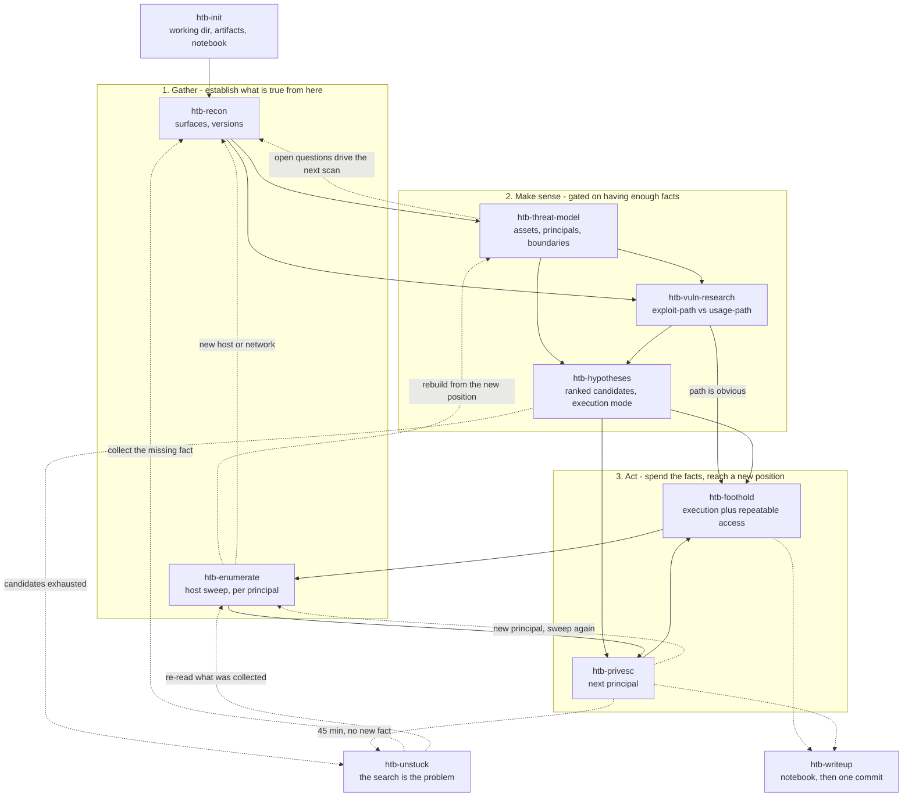

# Working an HTB box

Authorized practice against HTB's own targets. The user drives box control (VPN, resets,
scope) and often runs commands themselves; I drive enumeration and exploitation.

## The workflow

Not a pipeline. Three clusters that feed each other, plus a recovery path and a writeup that
runs throughout. **Sequencing lives here and only here** — each skill is self-contained and
does not name what follows it.

### How to read it

**Information gates thinking.** `htb-threat-model` and `htb-hypotheses` are downstream of
`htb-recon` and `htb-enumerate`, never upstream: a model built on nothing is a guess wearing
structure, and hypotheses generated from an unexamined inventory just re-encode the blind
spot. If a thinking skill feels unproductive, the deficit is usually in cluster ①.

**Thinking redirects gathering.** The dotted edge back from the model is the point of
building one — its open questions are what the next scan should answer. Without that edge
recon is a generic checklist.

**Acting returns you to gathering, one position further in.** `htb-enumerate` is cluster ①
run from inside; every pivot restarts the cycle with a different reachable surface, a
different set of boundaries, and different assets. The model is rebuilt from the new
position rather than extended.

**The clusters are not stages to complete.** On an easy box the loop turns once and
`htb-hypotheses` never fires. On a hard one the same three clusters cycle several times per
principal.

### Entry conditions

Invoke by precondition, not by position in a list:

| Skill | Invoke when | Produces |
|---|---|---|
| `htb-init` | a new box, before anything else | working dir, three artifacts, notebook |
| `htb-recon` | at the start, and whenever a pivot exposes a new network | exact versions in `ledger.md` |
| `htb-threat-model` | enough surface is known to name boundaries; again after each pivot | `threat-model.md` + the questions recon should answer |
| `htb-vuln-research` | components have exact versions | each classified, with a cheapest-test per candidate |
| `htb-hypotheses` | information is sufficient but no path is obvious | `hypotheses.md`, ranked, execution mode agreed |
| `htb-foothold` | a lead is ready to fire, or any new credential appears | execution + a repeatable way back in |
| `htb-enumerate` | any shell, once per principal | full sweep with coverage reported |
| `htb-privesc` | the sweep has produced leads | the next principal |
| `htb-unstuck` | ~45 min on one pivot with no new fact | the missing fact, and why it was not collected |
| `htb-writeup` | each milestone lands, and at the end | `BoxName.ipynb`, one `HTB: BoxName` commit |

Three artifacts live in the working directory alongside the scripts and loot —
`ledger.md` (state), `threat-model.md` (structure), `hypotheses.md` (candidates). All three
are created at bootstrap and are written to as work happens, not at the end.

## Dispatch

Invoke one skill at a time and finish its phase before moving on. When resuming a box,
read the working dir's `ledger.md` first and rebuild the task list from it — it is the source of truth for what has been
tried, what is dead, and which credentials exist.

Phase boundaries are also the checkpoints worth reporting: say what the phase established,
what it ruled out, and what the next phase will try.

## Ledger and task list

Two trackers, different lifetimes. Keep both.

**`ledger.md` in the working directory is durable shared state.** The user reads and writes
it too, so it is how you stay in sync with them — and it is what survives a box reset, a
context compaction, or a new session days later. It carries status, access per principal,
credentials and where each was sprayed, services and versions, open leads with their kill
criteria, dead branches with the evidence that killed them, provisional results, and a
timeline. Append and supersede; never delete. A fact that cost effort goes in the moment it
is obtained, not at the end of the phase.

**The `Task*` tools are the in-session working set.** At the start of a phase, `TaskCreate`
one task per open lead and per checklist item. `TaskList` picks the next one — lowest ID
first, since earlier tasks set up context for later ones — `TaskGet` gives its full detail
and dependencies, and `TaskUpdate` moves it to `in_progress` before work starts and
`completed` when it lands. Read a task with `TaskGet` before updating it; state goes stale.
Keep exactly one task `in_progress`.

Use the structure these tools provide rather than a flat list:

- **`addBlockedBy`** for genuine preconditions — the exploit task blocked by the cheap check
  that would kill it, the escalation task blocked by the enumeration sweep. A blocked task
  cannot be claimed, which is what mechanically prevents starting on a hypothesis whose
  premise is unverified.
- **`metadata`** to carry the ledger's lead number, so a task and its ledger row stay linked
  across a compaction.
- **`owner`** when a subagent takes a task, so the dispatch is visible in the list rather
  than only in your head.
- **`activeForm`** so the spinner names the actual probe in progress.
- **`completed`** means the result is written to the ledger — including a *disproven*
  hypothesis, which is finished work with a row in **Dead**, not a deletion. Reserve
  `deleted` for tasks created in error.

The task list is a scratch view over the ledger, never the record itself — if the two
disagree the ledger wins, and the list is rebuilt from it with `TaskCreate`.

The handoff rule: **a task is not done when the command succeeds, it is done when its result
is in the ledger.** The same applies to anything a subagent returns — record its finding and
the excerpt it was working from, so a later session can judge it.

## Rules of engagement

**Pace.** These are small single-host VMs. One job at a time, 2–4 threads, and never stack
a web sweep with a spray and an expensive server-side render. A degraded target silently
turns timeouts into false negatives — classify errors/timeouts as a *third* outcome
distinct from hit and miss, and abort a sweep when they appear rather than recording them
as misses. Before launching a sweep, estimate the request count and say it out loud.

**Never probe append-only shared state with a malformed payload.** Before any probe, ask
whether an accepted value can be removed again. If it cannot — a transaction pool, job
queue, ledger, append-only table — test validation with well-formed-but-wrong values, never
with an empty or truncated body. A stuck malformed entry can break the progression path and
force a reset.

**No box writeups or walkthroughs.** Researching a CVE, tool, or underlying primitive is
encouraged; searching for this machine's solution is not.

**Distinguish observation from inference.** An exploit that visibly worked is a result.
"Nothing called back", "the sweep found nothing", "the port is closed" are inferences from
absence — label them provisional in `ledger.md`, because a degraded target manufactures them.

**Suspect the target, not just the approach.** Repeated stalls under light load, especially
combined with no community first blood well after release, is evidence about the box. Say so
early and offer parking it as a real option instead of escalating effort.

**Record artifacts, not just outcomes.** Every step goes into the working directory as a
numbered, re-runnable script. Boxes get reset; anything not scripted will be retyped.
