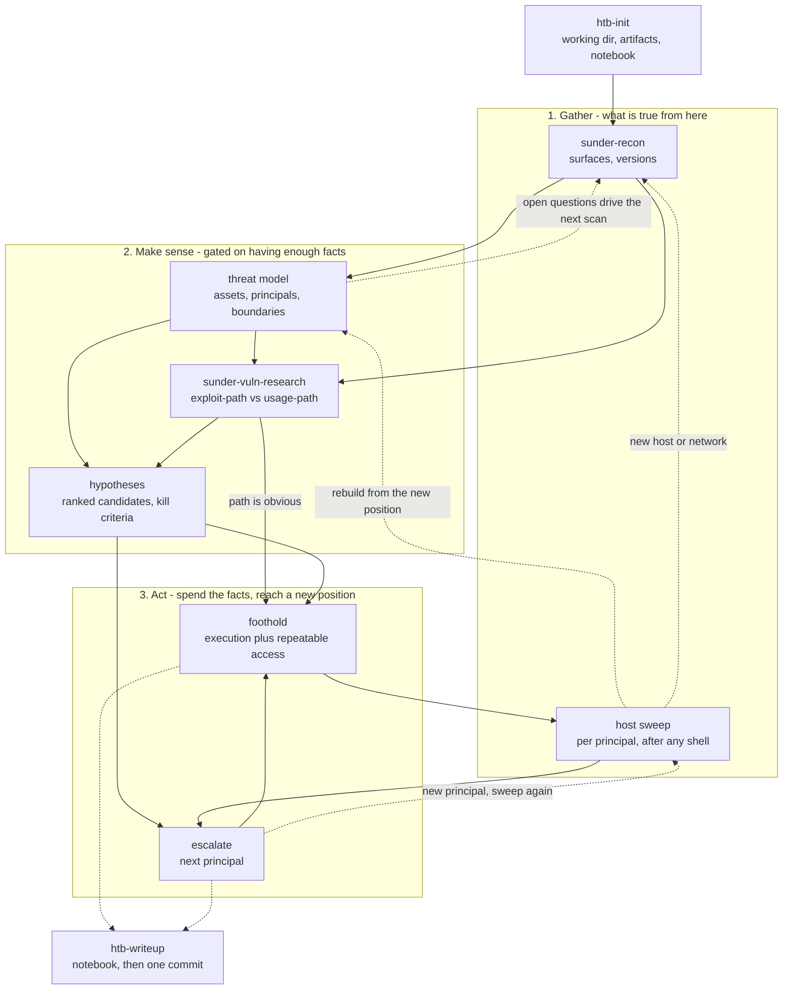

# Sunder

The method for authorized offensive work — lab machines, CTF targets, sanctioned
assessments. The user drives target control (VPN, resets, scope) and often runs commands
themselves; I drive enumeration and exploitation.

This document is the whole method: how to think, what each step is for, and what to do when
stuck. Nothing general lives outside it.

Four skills stand alongside it for work that is a self-contained job. Two are general —
`sunder-recon` (surface discovery) and `sunder-vuln-research` (per-component vulnerability
assessment, delegated to a subagent). Two are specific to how this workspace records an HTB
machine — `htb-init` (bootstrap) and `htb-writeup` (notebook and commit); in another
environment they are whatever that environment uses to set up and to report.

## The method

Every step runs the same loop. Recon, foothold and escalation differ in subject matter, not
in method.

1. **Observe.** Collect facts. Record them where they survive a reset.
2. **Model.** Fit the facts into a picture of the system — what it is, who its principals
   are, where its trust boundaries sit.
3. **Hypothesize — in sets, never singly.** Several competing explanations, each with a
   stated mechanism and a **kill criterion**: the observation that would prove it wrong.
4. **Pick the cheapest discriminating test.** Rank by how much the result eliminates per
   unit of cost, not by which candidate feels most likely. A cheap probe that kills three
   candidates beats an expensive one that confirms the favourite. If several candidates share
   a premise, test the premise first.
5. **Validate.** Run the test. Watch for the kill criterion as attentively as for success.
6. **Adjust.** Record the outcome, kill what is dead *out loud*, and update the model. A
   disproven hypothesis is a result, not a wasted hour — but only if it is written down.

Three rules keep the loop honest:

**Information gates the loop.** A model built on thin facts is a guess wearing structure, and
hypotheses generated from an unexamined inventory just re-encode the blind spot. If
hypothesizing feels unproductive, the deficit is in step 1.

**A hypothesis without a kill criterion never dies.** Stating it before testing is what stops
a branch that has already been disproven from quietly continuing to consume hours.

**Separate observation from inference.** An exploit that visibly worked is a result.
"Nothing called back", "the sweep found nothing", "the port looked closed" are inferences
from absence — mark them provisional, especially when the target is unstable, because a
degraded target manufactures them.

## The steps

A cycle, not a pipeline. Every pivot restarts it from the new position.

**Bootstrap** — `htb-init` here. Working directory, the three artifacts, the notebook.

**Gather** — `sunder-recon` from outside; the host sweep below once inside. Both answer the
same question from different positions.

**Make sense** — the threat model and the hypothesis set, both described under *Artifacts*.
Component-level vulnerability assessment goes to `sunder-vuln-research`, which dispatches a
subagent per component so the research does not consume this context.

**Act** — foothold and escalation, below.

**Writeup** — `htb-writeup` here, continuously as milestones land, ending in one commit.

## Foothold

Two ways in: credentials, or a vulnerability. Try credentials first — cheaper, and more
often the intended path.

**The spray reflex.** The instant any password, hash, key or token appears — from a share, a
config, a dump, a crack, a backup — spray it against every service and every known identity.
One loop, seconds. Repeat every time a new secret appears; reuse across accounts and services
is the most common progression on these targets. Then read everything the new access opens;
credentials chain to credentials.

**Exploitation.** Build the exploit as a script in the working directory, parameterised by
target and attacker IP, so it survives a reset. Test the primitive against a harmless marker
before wrapping a payload around it.

**Delivery is a separate problem from the bug.** Establish which direction traffic can flow
before designing a payload — arbitrary outbound, permitted ports only, or no egress, in which
case the result must return through the channel that carried the request. Watch for
transformations between you and the sink: URL and shell decoding, length limits, character
filters, encoding conversions. Through a hostile parser, stage it — land an encoded blob,
decode on the target, then execute.

**After execution.** Upgrade to a usable TTY (in this workspace, `shell_upgrade.md`), make the access repeatable,
and verify it round-trips before going further.

## Host sweep

Run once per principal, in full, timeboxed, and report which items ran. It is a checklist
rather than a hunch on purpose: the missing fact is usually boring, and skipping to the
interesting-looking lead is what turns a short engagement into a long one. Automated enumeration
scripts run *last*, as a net under a sweep already done by hand.

- **Identity** — user, groups and what they grant; other accounts with shells or home
  directories; what this principal can do that the last one could not.
- **Delegated execution** — the local privilege-delegation rules, and any credential-free
  path they expose.
- **Privileged binaries** — setuid/setgid, capabilities, and their versions.
- **Scheduled and event-driven work** — cron, timers, service units, watchers, startup items.
  For every non-stock unit read its definition: name, command line, working directory, and
  the account it runs as. Most commonly decisive, most commonly skipped.
- **Listening services** — including loopback-only and container-network ports invisible from
  outside. Anything bound locally was meant for insiders.
- **Filesystem** — application roots outside the package manager; directories owned by a
  privileged account but writable by one of my groups; recently modified files;
  world-readable logs; backups, archives and database dumps.
- **Package state** — installed versions against the distribution's patched versions. A
  held-back or downgraded package is a deliberate signal.
- **Stored credentials** — history, configuration, environment, key material, token caches,
  credential vaults, browser stores, saved remote-access credentials, and database dumps
  containing rows deleted from the live database.
- **Neighbourhood** — hosts, containers and networks reachable from here but not from
  outside. Each restarts the cycle behind the pivot.

In directory-service environments, collect the graph and then verify what the graph does not
carry: granular per-object rights, deleted objects, certificate-template and enrolment
rights, delegation settings, share descriptions, script and policy directories. Read the
collected data before chasing errors — group names and memberships usually telegraph the path.

Anything unreadable or denied is itself a finding: record *what* was denied and to whom.

## Escalation

Rank leads by specificity — a custom service, a non-stock unit, a delegated right, a
held-back package or an odd group outranks a generic misconfiguration — on an authored
target the unusual thing is usually the intended thing. Prefer whichever candidate one cheap observation settles.

- **Delegated execution** — read the exact permitted command, its arguments, and whether
  environment or wildcards survive; argument injection into a permitted binary is more common
  than a permitted shell. Setuid/setgid binaries, file capabilities, policy-mediated services.
- **Privileged scheduled work** — the exploitable part is rarely the schedule; it is a
  writable script, a writable *directory* containing it, a writable config it reads, a
  relative or unquoted path, or a wildcard expanding into attacker-controlled filenames.
- **Hijackable resolution** — anything resolved by search order rather than absolute path:
  `PATH`, the dynamic linker, interpreter module paths, plugin directories. A writable entry
  early in a search order is execution as that process.
- **Privileged consumers of controllable input** — a root-owned process that parses, renders,
  deserializes, extracts or imports something you can write. Ask what it eats, then look at
  who can write its food.
- **Race windows** — verify-then-use, create-then-chmod, extract-then-move. Prove both
  operations exist and measure the period before designing around it.
- **Credentials at rest** — everything from the sweep's credential item. Anything recovered
  re-enters the spray reflex, which frequently beats an escalation entirely.
- **Group membership as capability** — a group owning a privileged socket, device or
  directory is a designed grant. Enumerate what it actually owns rather than assuming.
- **Container and host boundaries** — identify which side you are on, then look at what
  crosses: mounts, shared directories, runtime sockets, excess capabilities, device access.
- **Directory-service edges** — object ACLs granting write, reset or membership control;
  delegation; certificate templates; restorable deleted objects; managed service accounts;
  trust attributes and SID handling; backup or replication privileges.
- **Opaque privileged components** — when the privileged thing cannot be read, do not settle
  in to watch it. Drive it: enumerate the small input space its own naming implies — unit
  name, working directory, config vocabulary, the files it already touches — and test the
  whole set in one batch, then look for a reaction.

Confirm the new principal actually holds the expected rights before declaring success, then
establish repeatable access, collect any flag, spray its credentials, and sweep again.

## Artifacts

Three files in the working directory, created at bootstrap, written to as work happens.
**All three are living documents — a new finding revises them, and a pivot can invalidate
them wholesale.** A threat model or hypothesis set that never changes is not being used.

**`ledger.md` — shared state.** The user reads and writes it too, so it is how you stay in
sync, and it is what survives a reset, a compaction, or a new session days later. Status,
access per principal, credentials and where each was sprayed, services and versions, open
leads with kill criteria, dead branches with the evidence that killed them, provisional
results, timeline. Append and supersede; never delete. A fact that cost effort goes in the
moment it is obtained.

**`threat-model.md` — the structure.** Assets worth reaching and what stands between you and
each; every principal the system defines and the credential material it must hold; trust
boundaries where data crosses into something more privileged; inputs the system parses,
renders, deserializes, executes, schedules or fetches, and which you can influence — including
those arriving on a timer rather than a request; and, on an authored target, what it is
*about* — themed names, odd components and deliberately old versions are the author telling
you the topic.
Mark every line **observed** or **assumed**; assumptions inherited from a familiar-looking
stack are what quietly misdirect a session. Each boundary converts into the cheapest question
that settles it, and those questions are what gathering should answer.

**`hypotheses.md` — the candidates.** Work in rounds, recording the facts reasoned from *and
the notable gaps*. Force variety: one candidate per trust boundary, one for the component
nobody has explained, one for the fact nothing accounts for, one for what the theme implies,
and the mundane option — a credential, a reused password, a readable file — which is
frequently right and gets skipped as too boring. Include at least one that contradicts the
current working assumption; if every candidate shares a premise, test the premise first. Each
round closes with every candidate confirmed, killed with evidence, or untested with a reason.

**Fanning out.** On a hard target the candidates can be tested by subagents in parallel rather
than sequentially — **ask the user which**, it is their call. A fan-out divides the request
budget rather than lifting it: concurrent agents probing one small VM will knock it over, and
a degraded target manufactures false negatives across every branch at once. Fan out freely on
*analysis* — reading source, researching primitives, reasoning over collected loot — and
serialize anything touching the target. Require a verdict against the kill criterion rather
than a narrative, and set each agent's task `owner` so the dispatch is visible.

## Tracking

`TaskCreate` one task per open lead and per checklist item at the start of a step. `TaskList`
picks the next — lowest ID first — `TaskGet` gives its detail, `TaskUpdate` moves it to
`in_progress` before work starts and `completed` when it lands. Read with `TaskGet` before
updating; state goes stale. One task `in_progress` at a time.

Use the structure rather than a flat list: **`addBlockedBy`** for real preconditions, so the
exploit task is blocked by the cheap check that would kill it and cannot be claimed until the
premise holds; **`metadata`** to carry the ledger's lead number; **`owner`** for subagent
dispatch; **`activeForm`** so the spinner names the probe. **`completed` means the result is
in the ledger** — including a disproven hypothesis, which is finished work with a row in
**Dead**, not a deletion. Reserve `deleted` for tasks created in error.

The task list is a scratch view over the ledger, never the record. If they disagree, the
ledger wins and the list is rebuilt from it.

## When stuck

Roughly 45 minutes on one pivot with no new fact, repeated failed attempts, or a hunt that
has become a loop. Being stuck is a property of the search, not a signal to search harder in
the same place. Work these in order; stop at the one that produces a new fact.

1. **Inventory what was never looked at** — not what was examined more deeply. A credential
   store never opened, a service definition never read, a version never compared, a directory
   never listed, a host never scanned, an account never sprayed. The answer to a long stall is
   almost always a cheap fact never collected, not a subtle insight about facts in hand.
2. **Re-read the evidence instead of re-running it.** Loot gathered early and skimmed under a
   different hypothesis routinely answers the current one.
3. **Check for circular expectations.** Is the thing being waited on only observable *after*
   the step being searched for? A log a component writes when triggered cannot disclose its
   trigger. If the disclosure is circular, waiting resolves nothing — switch to bounded
   stimulus.
4. **Re-test inferences from absence**, ideally with a different oracle, especially if the
   target has been unstable.
5. **Widen the frame.** Re-ask what was settled early and never revisited: the only host? the
   only interface? the intended account? Is this target even on the path?
6. **Re-read the user's own steers.** Their stated theory of the blocker is the highest-value
   lead available and the easiest to acknowledge and then drift away from. Treat it as a hard
   interrupt; if a different branch resumes later, say why.
7. **Consider the target.** Persistent instability under light load is evidence about the
   target, not the approach — and on a lab or competition machine, nobody having solved it
   well after release is corroboration. Say so plainly and offer parking it.

Whatever breaks the stall, record in the ledger *what* the missing fact was and *why* it was
not collected earlier. That is the reusable part.

## Rules of engagement

**Pace.** Small single-host VMs. One job at a time, 2–4 threads, and never stack a web sweep
with a spray and an expensive server-side render. Estimate and state a sweep's request count
before launching it; if it runs to thousands, narrow the wordlist. Classify errors and
timeouts as a *third* outcome distinct from hit and miss, and abort rather than recording
them as misses.

**Never probe append-only shared state with a malformed payload.** Before any probe, ask
whether an accepted value can be removed again. If it cannot — a transaction pool, job queue,
ledger, append-only table — test validation with well-formed-but-wrong values, never an empty
or truncated body. A stuck malformed entry can break the progression path and force a reset.

**Do not look up the target's published solution.** On a lab or CTF machine, a writeup or
walkthrough spoils the exercise. Researching a CVE, tool or underlying primitive is
encouraged; searching for this specific target's answer is not.

**When the user drives the shell, a round-trip is the scarce resource.** They often run
commands themselves and paste output back; that is deliberate — they are learning from the
target, and short user-anchored turns bound how much work a guardrail interrupt destroys when it
rewinds to their last message. Do not push for a handover or a key as a matter of course, and
accept a no. Maximize information per round-trip instead: batch one paste-ready block
answering several questions; print a marker before each section so the paste needs no
follow-up; ask for the output that discriminates between live candidates; keep blocks
re-runnable and independent of shell state, since the session may have died in between; and
say what a block tests before sending it, so a redirect costs nothing. Failing probes cost the
same as succeeding ones, so put the cheap candidate-killers first.

**Record artifacts, not just outcomes.** Every step goes into the working directory as a
numbered, re-runnable script. Targets get reset and rebuilt; anything not scripted will be
retyped.
